# Posterior Sampling for Reinforcement Learning

Replica of results from the
[paper](https://proceedings.neurips.cc/paper/2013/hash/6a5889bb0190d0211a991f47bb19a777-Abstract.html)
that introduces Posterior Sampling for Reinforcement Learning (PSRL) algorithm.

Osband, I., Russo, D., & Van Roy, B. (2013). (More) efficient reinforcement
learning via posterior sampling. Advances in Neural Information Processing
Systems, 26.

The current codebase supports the following RL environemnts:

- Random MDP
- [RiverSwim](https://www.sciencedirect.com/science/article/pii/S0022000008000767)
- [TwoRoom gridworld](https://arxiv.org/abs/2202.03466)
- [FourRoom gridworld](https://arxiv.org/abs/2202.03466)

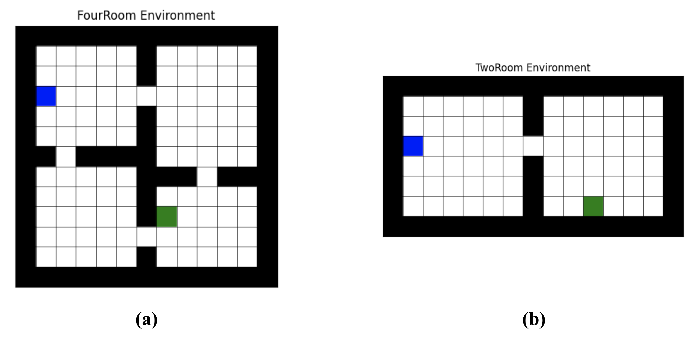


## Installation

1. Create conda environment

```bash
cd psrl/
conda create --name psrl python=3.9
conda activate psrl
```

2. Install requirements

```bash
pip install -r requirements.txt
pip install -e .
```


## Running experiments

To replicate all plots first run the optimization process for each agent and
environment

```bash
python scripts/generate_data.py --config configs/riverswim_psrl.yaml --seed 0
```

This script will produce files `agent.pkl` and `trajectories.pkl` which store
the trained parameters of the optimized agent and the trajectories taken in the
environment throughout the execution of the program. Choose between any of the
configuration files in `config` folder to generate data specific for each
experiment.

The most straightforward way to obtain all data necessary for plots is to just
run the following script

```bash
. run_parallel.sh
```

which launches all combinations of environments (riverswim, tworoom, fourroom),
agents (psrl, ucrl, kl_ucrl), and seeds (10 in total, starting at 0) using
`screen`.

After all runs come to an end, you can obtain regret plots by running

```bash
python scripts/plot_regret.py --config configs/regret_riverswim.yaml
```

Switch between the following configs to obtain a regret plot for each
environment:

- configs/regret_riverswim.yaml
- configs/regret_tworoom.yaml
- configs/regret_fourroom.yaml

With `configs/regret_riverswim.yaml` you should expect the following plot

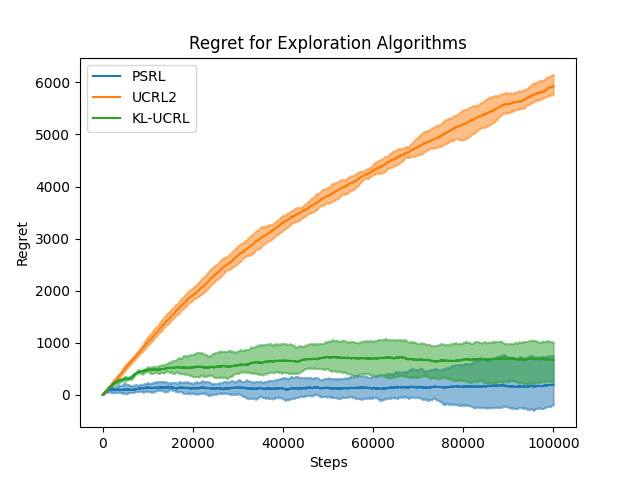

Likewise, with a single run you can obtain agent-specific plots for
gridworld environments by running

```bash
python scripts/plot_agent.py --config configs/tworoom_klucrl.yaml
```

Choose the right configuration to obtain a set of plots for any particular run.
You should obtain all the following plots:

- Action-value function
- Empirical state visitation
- Empirical total reward
- Expected reward
- Policy
- State-value function

For `configs/tworoom_klucrl.yaml` (after setting no_goal=False)
you should expect the following
- Action-value function
  
- Empirical state visitations
  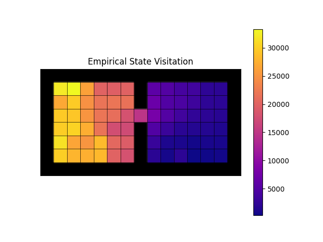
- Empirical total reward
  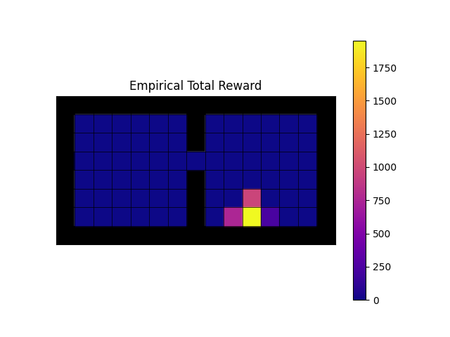
- Expected reward
  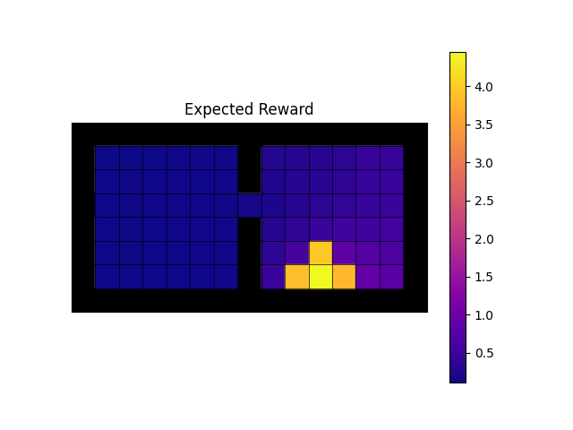
- Policy
  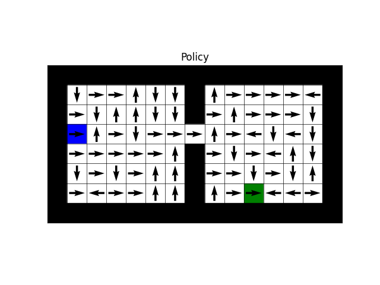
- State-value function
  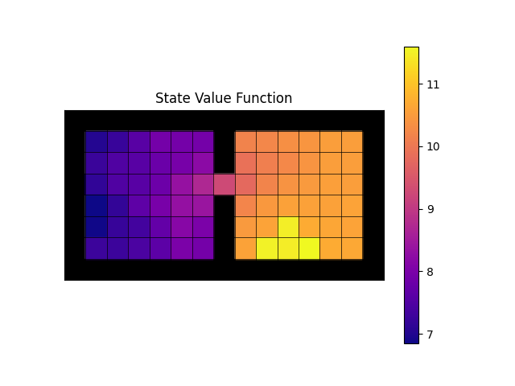


For `configs/fourroom_klucrl.yaml` (after setting no_goal=False)
you should expect the following
- Action-value function
  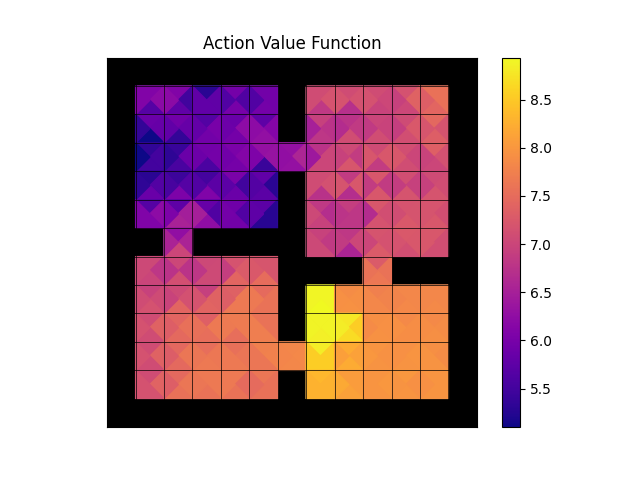
- Empirical state visitations
  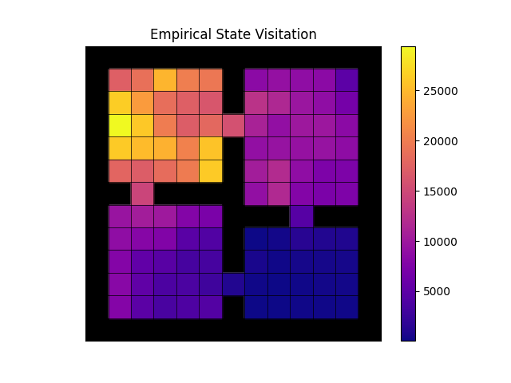
- Empirical total reward
  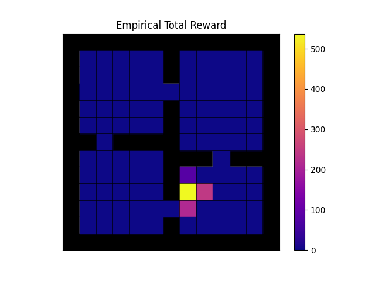
- Expected reward
  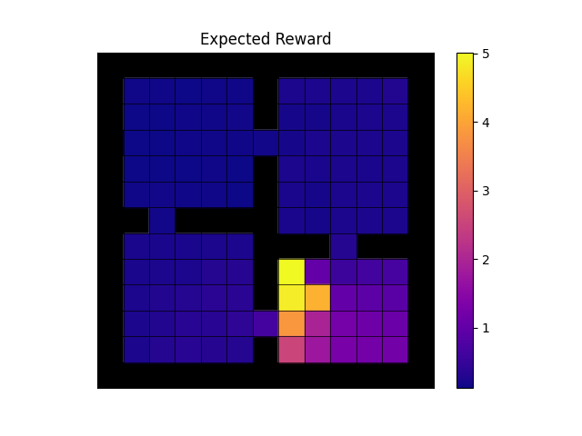
- Policy
  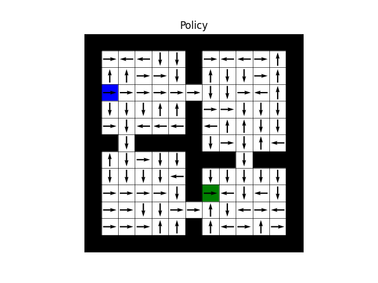
- State-value function
  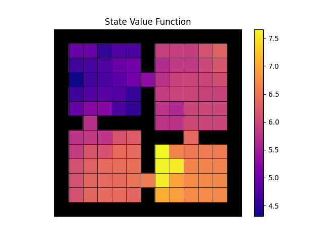


## Disclaimer

This project includes multiple other scripts that are undocumented. These were meant for a research project that was left unfinished, so they do not directly connect to the original paper. Likewise, there is no guarantee that results obtained from them produce any meaningful output yet.